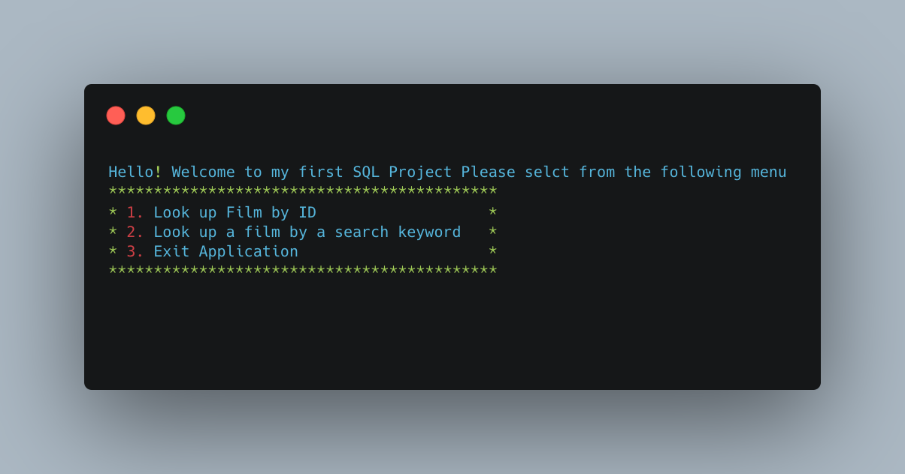

### Technologies Used

[Java](https://www.oracle.com/java/technologies/)  
[Object Oriented Programming](https://docs.oracle.com/javase/tutorial/java/concepts/)  
[Eclipse](https://www.eclipse.org/)  
[SQL](https://dev.mysql.com/doc/) 
[AWS](https://aws.amazon.com/) 
[Interfaces](https://www.baeldung.com/java-interfaces#:~:text=In%20Java%2C%20an%20interface%20is,abstraction%2C%20polymorphism%20and%20multiple%20inheritances.&text=We%20can%20implement%20an%20interface,by%20using%20the%20implements%20keyword.) 

  
* How to navigate through a database  
* How to take database information and manipulate it through Java  
* How to run a server through AWS  
* Further refining my skills of OOP (Object Oriented Programming)  
* Basic mark down for README  
* Implementing banners and photos inside of README  

  
 
 
 
 
When you start the program you will be greeted by a user menu as seen below.  
	* First start by downloading the file an opening up with your IDE of choice and/or if you like doing terminal commands that works too! 
	* Simply select one of the 3 options in the user menu.  
	* Carefully follow the instructions when trying to quit each sub menu. Press 0 to quit the first sub menu and goback as 1 word for the second menu. To quit the application Simply press 3. 
	   

Select one of the following options in the User Menu to display said information. This program is pulling information based off a fictional video store referred to as "sdvid". 

